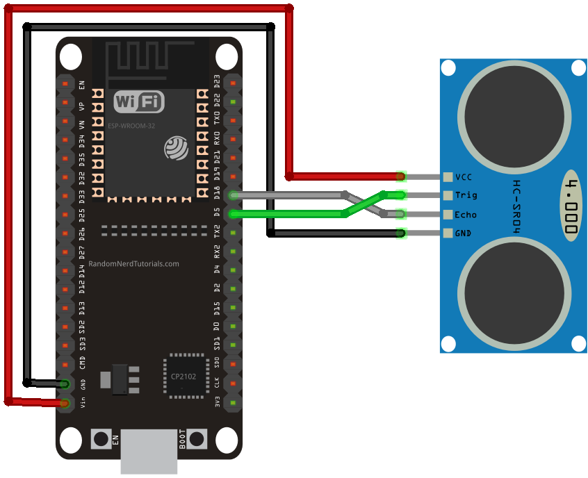

# Blind Spot BLE Arduino

  

## Overview

This example shows an Arduino board with a HC-SR04 Ultrasonic sensor sending measured distance using sound from Arduino to Spectacles via BLE. This could be used like in this example to alert a Spectacles user riding a bicycle of the presence of a car in their blind spot.

The project is currently setup to detect objects using the ultrasonic sensor and display an icon in the HUD on the right hand side for use in Australia where the blind spot would be located on the right-end side. If you intend to use it, don't forget to adapt the project for your local road side.

In the demo, the arduino board and ultrasonic sensor where placed on the rear bike carrier at approx. 60 cm height and angled towards the right by 20-30 degree to detect upcoming cars from the rider's blind spot from a distance of 300cm. 

This is an experimental demo, use at your own risks! Be safe and always follow road rules.

> **NOTE:**
> This project will only work for the Spectacles platform and Lens Studio.

## Prerequisites

- **Lens Studio**: v5.10.0+
- **Spectacles OS Version**: v5.62+
- **Spectacles App iOS**: v0.62+
- **Spectacles App Android**: v0.62+

To update your Spectacles device and mobile app, please refer to this [guide](https://support.spectacles.com/hc/en-us/articles/30214953982740-Updating).

You can download the latest version of Lens Studio from [here](https://ar.snap.com/download?lang=en-US).

## Getting Started

To obtain the project folder, clone the repository.

> **IMPORTANT:**
> This project uses Git Large Files Support (LFS). Downloading a zip file using the green button on GitHub **will not work**. You must clone the project with a version of git that has LFS.
> You can download Git LFS [here](https://git-lfs.github.com/).

## Initial Project Setup

1.) Download and install the latest <a href="https://www.arduino.cc/en/software/">Arduino IDE</a>.

2.) Install esp32 by Espressif Systems from the <a href="https://support.arduino.cc/hc/en-us/articles/360016119519-Add-boards-to-Arduino-IDE">board manager</a>.

3.) Choose board Esp32 -> Node32s

4.) Choose port /dev/cu.usbserial-0001

5.) Wire the ESP32 with HC-SR04 Ultrasonic Sensor
 
<a href="https://randomnerdtutorials.com/esp32-hc-sr04-ultrasonic-arduino/">Source: randomnerdtutorials.com</a>  

6.) <a href="https://support.arduino.cc/hc/en-us/articles/4733418441116-Upload-a-sketch-in-Arduino-IDE">Upload</a> the Arduino code from /ESP32-BLE-blindspot/ on the ESP32.

## Testing the Lens

> **IMPORTANT:**
> The BLE API does not support editor testing at this time.

### On Spectacles Device

[Extended Permissions](https://developers.snap.com/spectacles/permission-privacy/extended-permissions) mode must be enabled because this lens uses the experimental BLE API.

1. Build and deploy the project to your Spectacles device.
2. Follow the [Spectacles guide](https://developers.snap.com/spectacles/get-started/start-building/preview-panel) for device testing.

## Disclaimer

This repository includes references to third-party websites and products for reference purposes only. These references are provided to enhance understanding.

The project is currently setup to detect objects using the ultrasonic sensor and display an icon in the HUD on the right hand side for use in Australia where the blind spot would be located on the right-end side. If you intend to use it, don't forget to adapt the project for your local road side and always follow road rules.

This is an experimental demo, use at your own risks! 

## Contributing

Feel free to provide improvements or suggestions or directly contributing via merge request. By sharing insights, you help everyone else build better Lenses.
